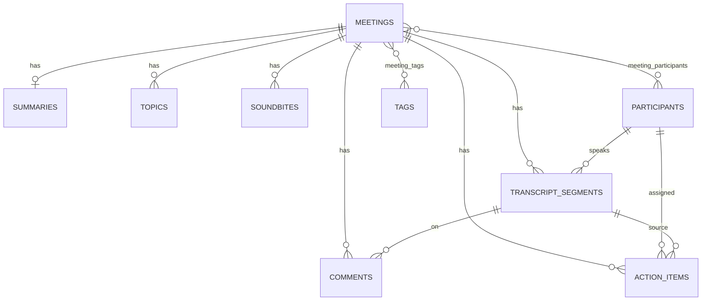

# Minutely

A Fireflies.ai-style meeting notes app. Browse a library of meetings, read interactive transcripts with speaker labels and timestamps, get summaries, action items and chapters, search across everything, and ask questions about a meeting.

Real speech-to-text is out of scope: transcripts are seeded, pasted, or uploaded (`.txt`, `.vtt`, `.json`), and summaries are generated from the transcript text.

## Features

**Core**
- **Meetings library:** title, date, duration and participants; search by title, filter by participant, tag and date range, sort by recency.
- **Meeting detail:** transcript with speakers and timestamps, a player with a seek bar, click a line to seek (and the transcript follows the player), search inside the transcript with highlighted matches.
- **AI notes:** overview summary, keywords, action items and chapters, generated on upload and pre-built for the sample meetings.
- **Meeting management:** create (form, paste or file upload), edit title / participants / tags, delete, and add / edit / complete / delete action items. Everything persists in SQLite.
- **App experience:** toasts, modals, a command palette, settings placeholder, and "Coming soon" pages for integrations and team.

**Bonus**
- Comments on transcript segments, and soundbites (highlighted clips, auto-generated)
- Export a meeting as Markdown, TXT or JSON, and export action items
- Global search across all meetings (`Ctrl + K`)
- Tags and tag filtering
- "Ask this meeting" chat with cited moments (LLM-powered)
- Per-meeting analytics (talk time, word counts) and an overview dashboard
- Dark mode

## Tech stack

| Layer | Technology |
|---|---|
| Frontend | Next.js 16 (App Router, TypeScript), React 19, Tailwind CSS 4, lucide-react |
| Backend | Python, FastAPI, Pydantic 2, Uvicorn |
| ORM / DB | SQLAlchemy 2, SQLite |
| LLM | Any OpenAI-compatible chat API via `httpx` (default: Groq) |
| Tests | pytest |

## Setup

### Prerequisites
- Python 3.10+
- Node.js 18+ and npm

### 1. Backend

Run these from the `backend/` folder. The SQLite file `minutely.db` is created in the folder you start the server from.

```bash
cd backend
python -m venv .venv

# Windows (PowerShell)
.venv\Scripts\Activate.ps1
# macOS / Linux
# source .venv/bin/activate

pip install -r requirements.txt
cp .env.example .env        # Windows: copy .env.example .env
uvicorn app.main:app --reload
```

The API runs at `http://127.0.0.1:8000`, with interactive docs at `/docs`. On first start the tables are created and the database is seeded with sample meetings, so the app is usable immediately.

### 2. Frontend

```bash
cd frontend
npm install
npm run dev
```

Open `http://localhost:3000`. The frontend talks to `http://localhost:8000` by default. To point it elsewhere, create `frontend/.env.local`:

```
NEXT_PUBLIC_API_URL=https://your-backend-url
```

### 3. Environment variables (`backend/.env`)

| Variable | Purpose | Default |
|---|---|---|
| `LLM_API_KEY` | API key for the "Ask" feature. **Optional.** Without it, Ask answers with retrieval only. | empty |
| `LLM_MODEL` | Model name | `.env.example` suggests `openai/gpt-oss-20b` |
| `LLM_API_URL` | OpenAI-compatible chat completions URL | `https://api.groq.com/openai/v1/chat/completions` |
| `CORS_ORIGINS` | Comma-separated allowed frontend origins | `http://localhost:3000` |

### 4. Tests

```bash
cd backend
pytest
```

## Architecture

```
minutely/
├── backend/
│   ├── app/
│   │   ├── main.py          # FastAPI app, CORS, router registration, seed on startup
│   │   ├── db.py            # engine, session, Base (SQLite with foreign keys enabled)
│   │   ├── models.py        # SQLAlchemy models (schema below)
│   │   ├── schemas.py       # Pydantic request/response models
│   │   ├── seed.py          # sample meetings (runs only if the DB is empty)
│   │   ├── routers/         # HTTP layer
│   │   │   ├── meetings.py      # CRUD, paste and upload
│   │   │   ├── action_items.py  # global list, add, edit, complete, delete
│   │   │   ├── comments.py
│   │   │   ├── soundbites.py
│   │   │   ├── search.py        # global search, tags, participants
│   │   │   ├── export.py
│   │   │   └── insights.py      # analytics and Ask
│   │   └── services/        # business logic
│   │       ├── parser.py        # .txt / .vtt / .json -> segments
│   │       ├── ingest.py        # segments -> meeting + notes, stored in one pass
│   │       ├── summarizer.py    # summary, keywords, chapters, action items
│   │       ├── qa.py            # intent detection + transcript retrieval for Ask
│   │       ├── llm.py           # optional LLM answer writer
│   │       ├── analytics.py, export.py, soundbites.py
│   └── tests/test_api.py
└── frontend/
    ├── app/                 # routes: library, meetings/[id], action-items, settings, coming-soon
    ├── components/          # Player, TranscriptPane, SummaryTabs, AskMeeting, CommandPalette, modals, ...
    └── lib/                 # api.ts (typed client), types.ts, format.ts, usePlayer.ts
```

**Design notes**
- **Thin routers, logic in services.** Routers validate input and delegate to services (for example `parse_transcript` and `ingest_transcript` for uploads).
- **Ingestion pipeline.** A pasted or uploaded transcript is parsed into segments, the summarizer generates the overview, keywords, chapters and action items, and everything is stored together.
- **Ask a question.** `qa.py` classifies the question (summary, action items or search) and retrieves transcript segments with timestamps. If `LLM_API_KEY` is set and segments were found, `llm.py` turns them into a short written answer. If the LLM is unavailable or fails, the retrieval answer is returned, so the feature always works. Answers include source chips that seek the player to the cited moment.
- **Player.** There is no real media file, so the player is driven by a simulated clock (`usePlayer`). Seeking, play / pause, speed and transcript sync all work against it.
- **Foreign keys.** SQLite ignores foreign keys by default, so `db.py` enables `PRAGMA foreign_keys=ON` on every connection. This makes the `ON DELETE CASCADE` and `SET NULL` rules below actually apply.
- **Frontend data.** All requests go through a typed API client (`lib/api.ts`) with shared types (`lib/types.ts`).

## Database schema

SQLite, defined in `backend/app/models.py`.



| Table | Key columns | Notes |
|---|---|---|
| `meetings` | `id`, `title`, `meeting_date`, `duration_sec`, `source`, `media_url`, `created_at` | `source` is seed / upload / paste / form. Indexed on `title` and `meeting_date` for search and sort. |
| `participants` | `id`, `name` (unique), `email` | Shared across meetings. Also the speaker of transcript segments and the assignee of action items. |
| `tags` | `id`, `name` (unique) | Shared across meetings. |
| `meeting_participants` | `meeting_id`, `participant_id` | Many-to-many join table (composite primary key). |
| `meeting_tags` | `meeting_id`, `tag_id` | Many-to-many join table (composite primary key). |
| `transcript_segments` | `id`, `meeting_id`, `speaker_id`, `start_sec`, `end_sec`, `text` | Composite index on `(meeting_id, start_sec)` keeps ordered transcript reads fast. |
| `summaries` | `meeting_id` (PK and FK), `overview`, `keywords` | One-to-one with a meeting. Keywords are stored comma-separated. |
| `topics` | `id`, `meeting_id`, `title`, `start_sec` | Chapters / outline, each linked to a timestamp. |
| `action_items` | `id`, `meeting_id`, `assignee_id`, `source_segment_id`, `text`, `due_date`, `is_done` | `source_segment_id` lets the UI jump to the moment the task was mentioned. |
| `comments` | `id`, `meeting_id`, `segment_id`, `body`, `created_at` | Comment attached to a transcript segment. |
| `soundbites` | `id`, `meeting_id`, `title`, `start_sec`, `end_sec` | Highlighted clips of a meeting. |

**Integrity rules**
- Deleting a meeting cascades to its segments, summary, topics, action items, comments, soundbites and join-table rows.
- Deleting a participant keeps their transcript lines and action items (`speaker_id` and `assignee_id` become NULL).
- Deleting a segment keeps action items (`source_segment_id` becomes NULL) and removes comments attached to it.

## API overview

Interactive docs: `http://127.0.0.1:8000/docs`.

**Meetings**

| Method | Endpoint | Description |
|---|---|---|
| GET | `/meetings` | List meetings. Query: `q`, `participant`, `tag`, `date_from`, `date_to`, `sort` (`date_desc` / `date_asc`) |
| POST | `/meetings` | Create a meeting from a form (title, date, participants, tags) |
| POST | `/meetings/paste` | Create a meeting from pasted transcript text |
| POST | `/meetings/upload` | Create a meeting from an uploaded transcript file (max 2 MB) |
| GET | `/meetings/{id}` | Meeting detail: transcript, summary, topics, action items |
| PATCH | `/meetings/{id}` | Edit title, participants, tags |
| DELETE | `/meetings/{id}` | Delete a meeting and everything attached to it |

**Action items**

| Method | Endpoint | Description |
|---|---|---|
| GET | `/action-items` | Action items across all meetings |
| POST | `/meetings/{id}/action-items` | Add an action item to a meeting |
| PATCH | `/action-items/{item_id}` | Edit or complete an action item |
| DELETE | `/action-items/{item_id}` | Delete an action item |

**Comments and soundbites**

| Method | Endpoint | Description |
|---|---|---|
| GET | `/meetings/{id}/comments` | List comments |
| POST | `/meetings/{id}/comments` | Add a comment (optionally on a segment) |
| DELETE | `/comments/{comment_id}` | Delete a comment |
| GET | `/meetings/{id}/soundbites` | List soundbites |
| POST | `/meetings/{id}/soundbites/generate` | Auto-generate soundbites |
| DELETE | `/soundbites/{soundbite_id}` | Delete a soundbite |

**Search, insights and export**

| Method | Endpoint | Description |
|---|---|---|
| GET | `/search` | Global search across all transcripts |
| GET | `/tags` | All tags |
| GET | `/participants` | All participants |
| GET | `/meetings/{id}/analytics` | Talk time and word counts per speaker |
| POST | `/meetings/{id}/ask` | Ask a question. Returns `answer`, `intent`, `sources` (and `generated: true` when the LLM wrote it) |
| GET | `/analytics/overview` | Totals across meetings: hours, open / done action items, top speakers |
| GET | `/meetings/{id}/export` | Export a meeting (Markdown, TXT or JSON) |
| GET | `/export/action-items` | Export action items |
| GET | `/health` | Health check |

## Deployment notes

- **Backend** (for example Render): root directory `backend`, build `pip install -r requirements.txt`, start `uvicorn app.main:app --host 0.0.0.0 --port $PORT`. Set `CORS_ORIGINS` to the frontend URL, and optionally `LLM_API_KEY` and `LLM_MODEL`.
- **Frontend** (for example Vercel): root directory `frontend`. Set `NEXT_PUBLIC_API_URL` to the backend URL.
- On free hosts the backend may sleep when idle, so the first request can be slow.

## Assumptions and limitations

- **No authentication.** A default logged-in user is assumed, as the assignment allows. Profile, Settings, Integrations and Team are placeholders.
- **No real audio.** The player is a simulated timeline so seeking and transcript sync can be demonstrated without media files.
- **Summaries, chapters and action items are rule-based**, generated from the transcript text. The LLM is used only for "Ask this meeting", and it is optional.
- **Transcript formats.** `.txt`, `.vtt` and `.json` uploads are supported, up to 2 MB.
- **Export formats** are Markdown, TXT and JSON (no PDF).
- **SQLite on hosted platforms** may use ephemeral storage. The database is re-seeded when empty, but meetings created on a free host can be lost on restart.
- **Sample data** is entirely fictional.
